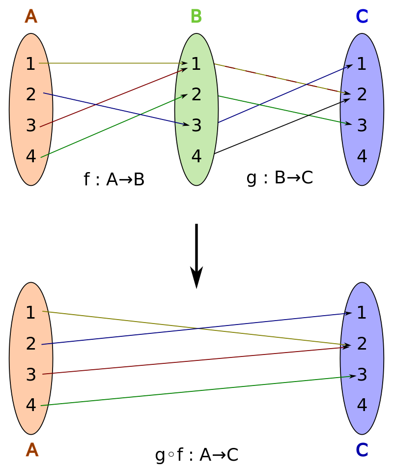

[index-notation]: https://en.wikipedia.org/wiki/Index_notation
[iterated-binary-operation]: https://en.wikipedia.org/wiki/Iterated_binary_operation
[set-builder-notation]: https://en.wikipedia.org/wiki/Set-builder_notation
[vector-notation]: https://en.wikipedia.org/wiki/Vector_notation

# Notation and basics

Quick recap of basic mathematical tools/concepts we need for our workshop. 
We first talk about numbers in coding and how from coding language we can map back to math. 
Then, we'll talk about vector spaces, functions and integrals. In this workshop though, we'll start from c++
coding examples and move "up" towards more general tools and concepts.
The idea is to consider the mathematical formalism just as another language to tinker with numbers and sometimes a bit more abstract concepts.
It's a fun idea to think of better ways to represent the mathematical notions in a more elegant way, we should definitely try to do that!

## Numbers, sums and products

We know from high-school the different types of numbers, the ones we'll only care about in this workshop are complex numbers associated with the set $\mathbb{C}$ and real numbers $\mathbb{R}$.
They can be both reasonably well (up to their binary representation and the limit to $\infty$) approximated by their numerical c++ counterparts `std::complex` and 32/64 bits floating point numbers such as `float` and `double`.
One last well-known mismatching, is the `=` sign. In c++ we can consider a variable `const` modifier and an equal as the equivalent to a definition. Without the `const` we would be able to redefine values of variables, which for 
languages like haskell will interpret as plain lying :) . On the other hand the `=` sign in math, can be loosely considered as a binary logical operator that returns true or false if the left and right side of the equation can be used
interchangeably anywhere without causing a logical fallacy.

In C++ to define a variable as the sum of two numbers to a variable `s` we do:

``` c++
const float s = 3 + 2; 
```

There's a one-to-one definition beteween c++ and math, a binary operator (such as '+' and '*') are both binary operators as they require two numbers to produce an output.
Assuming our approximation holds (mapping floats to real numbers), we can write the c++ line to a specific mathematical syntax $s : = 3 + 2, s \in \mathbb{R}$ which reads, 
's' is defined as the sum of three times two, where s is a real number.
The same applies to the product of two numbers in c++ (`*`) which in math, maps to the standard symbol "$\cdot$" or sometimes "$\times$". Like in c++, operators in math can be overloaded, 
so product and sums, can be sometimes defined on any object of any type, we'll later see how this overloading for instance can occur for vectors!

How about arrays? In c++ we can do something like:

``` c++
const float a[] = {1.2, 3.14, 7.2, 42};
```
to define an array of real numbers of size 4 with elements 1.2, 3.14, 7.2 and 42. To refer to an element at index `i`, in c++ you can use `a[i]`. 
In the mathematical world, an array can be represented via different [notations][vector-notation], in our workshop we decide to just define any variable as an array if it's in bold "$\textbf{a}$".
The elements of the array $\textbf{a}$ are instead represented via the [index notation][index-notation], which means you can use both subscripts and superscripts to specify indexes, for instance $a^i$ for the previous example. 
Or sometimes, for $n$ elements, via large vertical/horizontal parenthesis:

$$
\begin{pmatrix}
  a_{1} \\
  a_{2} \\
  \vdots \\
  \alpha_{n} \\
\end{pmatrix}
$$.

In the math world, single-valued variables are called scalars, arrays are instead called vectors.

It's nice to work with a lot of numbers but how can we summarize "long" operations such as:
``` c++
float r = 0;
float a[4] = {1, 3, 5, 2}
for (int i = 0; i < 4; ++i) {
    r += a[i] 
}
```

In math notation, this can be easily constructed using the $\Sigma$ [iterated-binary-operation][index-notation].
If we unrolled the loop, we would get: `const float r = a[0] + a[1] + a[2] + a[3]` and, in math notation:
$$
r : = a_0 + a_1 + a_2 + a_3, r \in \mathbb{R}, \textbf{a} = (1, 3, 5, 2)
$$

As we can see it would be nice to have an operator that just accumulates the $a_{i}$ values given some index. We can conveniently write this using:

$$
\sum_{i=0}^{3} a_{i}
$$

or, if we [define][set-builder-notation] the set $A := \{1, 2, 5, 2\}$, then:
$$
\sum_{i \in A} i
$$

There's a lot of flexibility in this notation!
What if we need to make a product instead of a sum? Just use:
$$
\prod_{i \in A} i
$$

Same rules applies!

### Tricks

On real numbers, "standard" sums and products have interesting simple properties, such as associativity, distributivity, commutativity, etc...
When we use these operations on summations and products we can play with the notation to greatly simplify statements!

For instance, given an arbitrary vector $\textbf{a}$ of size $n$ and a scalar (a number) $c$ is this true?
$$
\sum_{i=0}^{n} c \cdot a_{i} = c \cdot \sum_{i=0}^{n} a_{i} 
$$

<details><summary>Answer</summary>
<p>
Yes!, why?:
$$
c \cdot a_1 + c \cdot a_2 + \cdots + c \cdot a_n = c (a_1 + a_2 + \cdots + a_n) = c (\sum_{i=0}^{n} c \cdot a_{i}) 
$$

distributive/associative property, if the value has no index associated to any summing, we can take it out. This is not true if we are summing a value though.. we need to
be careful with parenthesis..
</p>
</details>

What if we use a double sum?

$$
\sum_{i=0}^{n}\sum_{j=0}^{n} a_{i} \cdot b_{j} = \sum_{i=0}^{n}a_{i}\sum_{j=0}^{n} b_{i} 
$$

<details><summary>Answer</summary>
<p>
Yes!, why?:
$$
\begin{split}
a_1 \cdot b_1 + a_1 \cdot b_2 + \cdots + a_1 \cdot b_n + a_2 \cdot b_1 + \cdots a_n \cdot b_n &= a_1 (b_1 + b_2 + \cdots + b_n) + a_2 (b_1 + b2 + \cdots + b_n) \cdots a_n (b_1 + b2 + \cdots + b_n) \\
&= \sum_{i=0}^{n}a_{i}\sum_{j=0}^{n} b_{i} 
\end{split}
$$

again distributive/associative property, if the value has no index associated to any summing, we can take it out. This is not true if we are summing a value though.. we need to
be careful with parenthesis..
</p>
</details>

These two tricks are fundamental for a topic we'll discuss next!
There are a bunch more tricks, that I won't show here, be careful though, there are a lot of false friends!

> **Note**
> It's easy to check with small values if a property holds! It's not a substitute to a proof, but it works well most of the times.

## Functions 


A function from a set X to a set Y is an assignment of an element of Y to each element of X. The set X is called the domain of the function and the set Y is called the codomain of the function.

A function, its domain, and its codomain, are declared by the notation  $f \colon X \longrightarrow Y$, and the value of a function f at an element x of X, denoted by $f(x)$, is called the image of x under f, or the value of f applied to the argument x.

Functions are also (loosely) called maps or mappings.

Two functions f and g are equal if their domain and codomain sets are the same and their output values agree on the whole domain. More formally:
Given $f \colon X \longrightarrow Y$ and $g \colon X \longrightarrow Y$, we have f = g if and only if $f(x) = g(x)$ for all $x \in X$

> **Note**
> A function for us is an abstract blackbox. How we practically perform the association, it's an implementation detail math doesn't care about :P 


Function can be composed composed as well!




### Numerical representation

There are two ways we can deal with functions: numerically and symbolically. 
Both methods are extremely important, the former to have a standardized language to prove things, the latter is especially when solutions to problems don't have a closed form (i.e solution cannot be symbolically written).

How do we deal with functions numerically? We usually just create ordered samples of them. Any signal, sound or image can be seen as a function having as domain 
a sampling frequency or a "pixel domain", we can think it a 2d set in which all the elements are locations of the pixels, and our image is a function of those locations.


# Spaces, dot product between vectors and functions.

Dot product, can be defined even between functiosn!

Anything special that we should be careful of? Sure square integrable.

 

# Integrals and derivatives


Sums and multiplications of real numbers. 
### Dirac deltas

### Euler formula


convert summation syntax as c++ code. Show what happens if you have constants, or independent indices
What if you have doulbe summation?

Derivatives and primitives.

When $a \ne 0$, there are two solutions to $(ax^2 + bx + c = 0)$ and they are 
$$ x = {-b \pm \sqrt{b^2-4ac} \over 2a} $$

